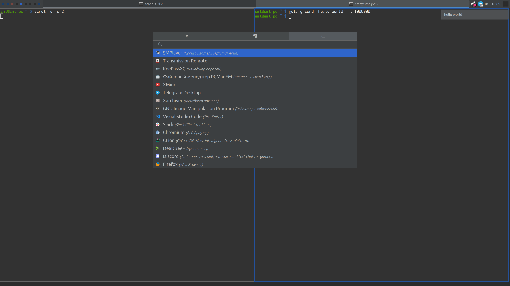
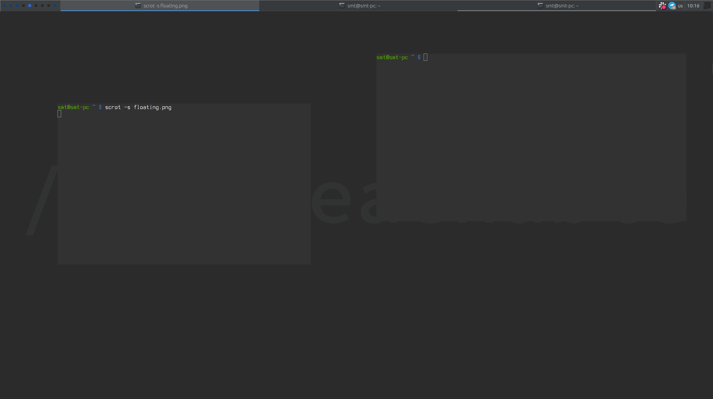
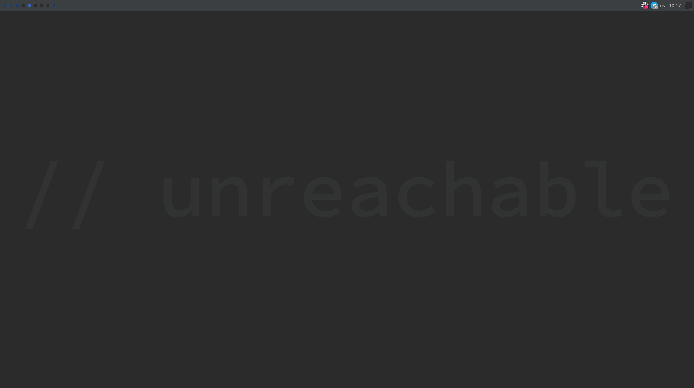

# awesomewm IWM config

Attempt to build WM with IDE-like behavior. Heavily inspired by IntelliJ IDEA.

** THIS IS WORK IN PROGRESS, EXPECT BUGS AND MISSING FEATURES **

## Features

 - First class HiDPI support (no images whatsoever)
 - Beautiful text wallpaper
 - Built with care for user sanity (keyboard bindings -wise)

## Planned features

 - Dual-stroke keybindings (like "press modkey twice") - will probably need root to listen to /dev/input
 - Custom launcher to support rofi-like combi on steroids (to include wm actions, where action resembles IDE actions)
 - Lots of widgets (bluetooth, wifi, battery, MPRIS,..)
 - Better design - will need help with this since I'm genetically unable to design anything and everything copied from IDEA that doesn't work well as WM design looks like shit (systray, client borders, widget borders and separation from everything else,..).

## Requirements

 - nodejs (to build config)
 - rofi (used as launcher for now: `Super+R`, `Super+P`, `Super+W`)

## Installation

1. Backup your current `rc.lua`
2. `npm run build && npm run install`
3. *(optional)* install rofi theme from [directory](./rofi), don't forget to install [iconic font](./rofi/icons/font) first

## Hacking around

Wait, this shit is built with typescript? - Yes, [tstl](https://github.com/TypeScriptToLua/TypeScriptToLua) & [awesomewm.ts.d](https://github.com/saksmt/awesomewm.d.ts) are used for that since I sincerely hate lua with all my might.

## Screenshots

## License

All sources are licensed with [MIT license](LICENSE)
